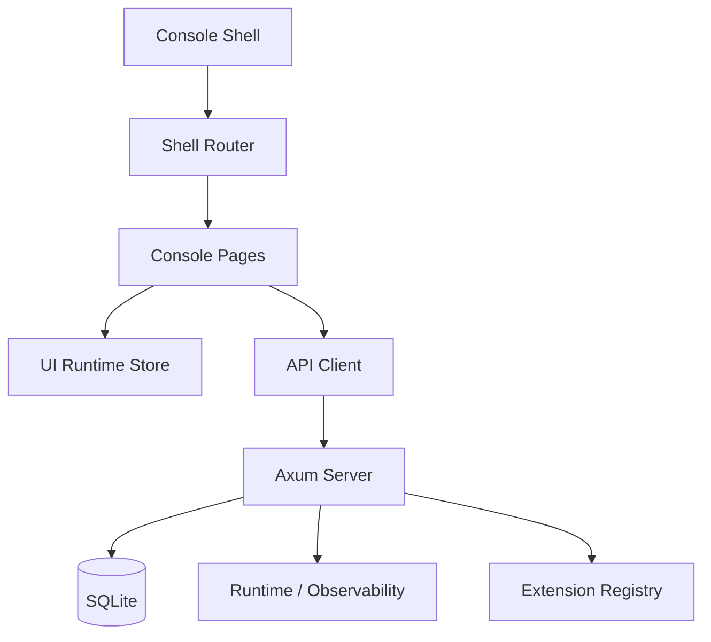

# 变更提案: shell-console-full-completion

## 元信息
```yaml
类型: 重构/补完
方案类型: implementation
优先级: P0
状态: 已确认
创建: 2026-04-20
```

---

## 1. 需求

### 背景
`Ennoia` 当前的后端领域与 API 已经覆盖了 `conversations / runs / tasks / artifacts / memories / jobs / extensions / ui runtime` 等正式能力，但 `web/apps/shell` 仍停留在“基础演示壳”阶段：导航和文案大面积硬编码、主题与国际化只接到了 store 没真正贯彻到页面层、定时任务/记忆/扩展/技能/日志/agent 配置缺少完整控制台视图，会话也只有新增没有删除。

用户已经明确要求：不考虑兼容包袱和时间难度，目标不是修几个点，而是一次性把控制台改到“完整可用、结构正确、后续可持续扩展”的状态。

### 目标
- 将 `web/apps/shell` 从“演示页集合”升级为“正式控制台”
- 统一壳层信息架构，补齐 `会话 / 工作流 / 任务调度 / 记忆 / 扩展 / 技能 / Agent / 日志 / 设置` 主导航能力
- 彻底收口 `i18n + 主题`，让壳层、导航、页面标题、操作文案、状态文案全部接入统一运行时
- 把后端已存在但前端未暴露的能力正式接出来：`jobs`、`memories`、`extension registry`
- 补齐缺失后端能力：至少包含会话删除链路，以及日志视图所需读取接口
- 形成一套“控制台优先”的页面骨架、数据加载模式与文档，不再继续在旧壳上零散补洞

### 约束条件
```yaml
时间约束: 不以开发时长为优先约束，允许一次性重构
性能约束: 继续基于本地单机运行，不引入远程服务或复杂实时基础设施
兼容性约束: 不保留旧壳层信息结构和临时页面组织，可直接按正式控制台重构
业务约束: 本轮以“控制台完整可用”为边界，优先接正式管理与观测能力，不扩展真实 provider 执行
```

### 验收标准
- [ ] `AppShell`、导航、页面标题和核心操作文案全部通过统一 i18n 入口输出，不再依赖页面内散落硬编码
- [ ] 主题能力支持“内置主题 + 扩展主题”统一展示、切换与即时生效，页面视觉不再出现主题未生效状态
- [ ] 控制台新增并接通 `Jobs / Memories / Extensions / Logs` 页面，现有 `Agents / Conversations / Workflows / Settings` 页面升级为正式管理视图
- [ ] 技能、扩展、Agent 配置、日志、调度任务至少具备“可查看”与核心管理能力；会话具备删除能力
- [ ] 后端新增必要接口后，前端能形成完整操作闭环：列表 → 详情/配置 → 创建/删除/执行 → 状态反馈
- [ ] `README.md`、`docs/architecture.md`、`docs/runtime-layout.md`、`docs/api-surface.md` 与最终实现保持一致
- [ ] 前后端校验通过：`cargo fmt --all`、`cargo check --workspace`、`cargo test --workspace`、`bun run --cwd web/apps/shell typecheck`、`bun run --cwd web/apps/shell build`

---

## 2. 方案

### 技术方案
采用“控制台优先的一次性重构”方案，分 5 个子域在同一轮实施内完成：

1. **壳层重构**
   - 重写 `AppShell` 信息架构，建立正式控制台导航与页面分组
   - 抽出共享的数据加载与格式化模式，避免每页重复 `loadWorkspaceSnapshot`
   - 为缺失模块新增页面：`JobsPage / MemoriesPage / ExtensionsPage / LogsPage`

2. **i18n 与主题收口**
   - 扩充 shell 级消息目录，把导航、页头、空态、动作、状态文案收敛到统一 key
   - 调整 `useUiStore` 与页面消费方式，使主题和语言切换成为全局一致行为
   - 把 extension registry 中的 theme / locale 贡献合并进设置与扩展页展示

3. **控制台能力补完**
   - 会话：列表、创建、删除、详情跳转和状态反馈完整化
   - Jobs：定时任务列表 + 创建入口 + schedule 字段可视化
   - Memories：列表、召回、审核操作入口
   - Extensions / Skills：基于 registry 与运行目录信息展示 pages/panels/themes/locales/extensions
   - Agents：从清单页升级为“配置与运行目录视图”
   - Logs：新增运行日志与 request/runtime audit 查看视图

4. **后端与 API 补口**
   - 为会话删除补后端 DELETE 接口和存储层删除逻辑
   - 为日志视图补最小读取接口，优先复用现有 observability/runtime audit 存储
   - 在 `api-client` 中补齐新增页面所需函数与类型

5. **文档与验证收口**
   - 同步文档、路由、页面层级与运行目录说明
   - 统一前后端验证脚本与结果回归

### 影响范围
```yaml
涉及模块:
  - web/apps/shell: 控制台壳层、路由、页面、样式与共享状态重构
  - web/packages/api-client: 新增日志/会话删除/控制台查询 API
  - web/packages/i18n: 补充 shell、settings、console 相关消息目录
  - web/packages/theme-runtime: 主题贡献合并与运行时应用修正
  - crates/server: 新增会话删除与日志读取路由
  - crates/server/db: 会话级联删除与日志查询支持
  - docs: architecture、runtime-layout、api-surface、README 同步
预计变更文件: 20-35
```

### 风险评估
| 风险 | 等级 | 应对 |
|------|------|------|
| 壳层重构范围大，易引入路由与状态回归 | 高 | 先统一导航与数据模型，再逐页替换；以 typecheck/build 和后端测试兜底 |
| 日志能力现有抽象较弱 | 中 | 先补“最小可用日志读取视图”，优先复用 runtime audit / request 记录 |
| 主题与国际化分散在多页 | 中 | 先建立统一 key 与 page helper，再逐页替换硬编码 |
| 会话删除涉及多表级联 | 高 | 在 db 层集中实现删除逻辑并补测试，前端只调用统一 DELETE API |

---

## 3. 技术设计

### 架构设计


### API设计
#### DELETE `/api/v1/conversations/{conversation_id}`
- **请求**: 无 body
- **响应**: `204 No Content`

#### GET `/api/v1/logs`
- **请求**: `kind?`、`limit?`、`cursor?`（最小分页/过滤）
- **响应**: `{ items: LogRecord[], next_cursor?: string | null }`

#### GET `/api/v1/jobs`
- **请求**: 无
- **响应**: `Job[]`

#### POST `/api/v1/memories/recall`
- **请求**: `{ owner_kind, owner_id, query_text?, namespace_prefix?, mode?, limit? }`
- **响应**: `RecallResult`

### 数据模型
| 字段 | 类型 | 说明 |
|------|------|------|
| `ConsoleNavItem` | 前端结构 | 控制台导航项，统一 label/icon/route/count |
| `ConsoleSnapshot` | 前端结构 | 控制台页复用的聚合快照与衍生视图 |
| `LogRecord` | 后端/前端共享类型 | 日志中心展示的最小记录结构 |

---

## 4. 核心场景

> 执行完成后同步到对应模块文档

### 场景: 会话控制台闭环
**模块**: shell / server / db
**条件**: 用户已进入控制台并拥有会话数据
**行为**: 查看会话列表 → 创建/进入会话 → 删除无用会话 → 列表即时刷新
**结果**: 会话不再“只有增没有删”，控制台具备基础治理能力

### 场景: 调度与记忆管理
**模块**: shell / api-client / server
**条件**: 系统内已有 jobs 与 memories 数据
**行为**: 用户进入 Jobs / Memories 页面，查看列表、创建调度任务、执行 recall/review
**结果**: 调度机制和记忆能力从“后端存在”变成“控制台可见可操作”

### 场景: 扩展与主题管理
**模块**: shell / extension-host / theme-runtime / i18n
**条件**: registry 中已有 page/panel/theme/locale 贡献
**行为**: 用户在 Extensions / Settings 中查看扩展贡献、选择主题与语言
**结果**: 扩展、技能、主题、语言包成为正式控制台的一部分，而不是隐藏能力

### 场景: 日志与运行观测
**模块**: shell / server / observability
**条件**: 系统运行产生 request/runtime audit 数据
**行为**: 用户进入 Logs 页面查看最近日志、筛选类型、定位问题
**结果**: 控制台具备基础观测能力，而不是只能改 logging 配置

---

## 5. 技术决策

> 本方案涉及的技术决策，归档后成为决策的唯一完整记录

### shell-console-full-completion#D001: 采用“一次性控制台重构”而非增量补洞
**日期**: 2026-04-20
**状态**: ✅采纳
**背景**: 用户明确表示“不考虑兼容、时间难度，要一次性改好”，现有 shell 的问题不是单点 bug，而是信息架构、页面覆盖与运行时接线整体不完整。
**选项分析**:
| 选项 | 优点 | 缺点 |
|------|------|------|
| A: 增量修补旧页面 | 变更看起来更小 | 会保留旧信息架构，后续继续欠债 |
| B: 一次性重构控制台骨架 | 能统一导航、状态、i18n、主题和管理页，后续扩展成本最低 | 本轮改动面更大 |
**决策**: 选择方案 B
**理由**: 现有缺口跨越壳层、页面、后端接口和文档，只有重构控制台骨架才能一次性解决根因。
**影响**: `web/apps/shell` 将发生结构级调整，`api-client` 和 `server` 需补最小正式接口

### shell-console-full-completion#D002: 日志能力采用“最小正式接口 + 正式日志页”落地
**日期**: 2026-04-20
**状态**: ✅采纳
**背景**: 运行目录与文档已定义 `logs/`，但 shell 没有日志页，server 也没有正式日志读取接口。
**选项分析**:
| 选项 | 优点 | 缺点 |
|------|------|------|
| A: 只展示 logging 配置 | 实现快 | 不能解决“没有日志视图”问题 |
| B: 增加最小日志查询 API 与日志页 | 可正式观测、可扩展到后续更丰富审计面板 | 需补 server/db/api-client |
**决策**: 选择方案 B
**理由**: 用户明确要求日志视图，必须提供实际日志读取能力，而不是继续停留在配置层。
**影响**: `crates/server`、`web/packages/api-client`、`web/apps/shell` 增加日志相关类型与页面

---

## 6. 成果设计

> 含视觉产出的任务由 DESIGN Phase2 填充。非视觉任务整节标注"N/A"。

### 设计方向
- **美学基调**: 深色作业台 + 观察站式控制台，强调“系统正在运转”的信息感，而不是营销风首页
- **记忆点**: 左侧能力导航、中部主视图、右侧/下方信息区组成的正式控制台结构
- **参考**: 延续现有 `midnight/paper` 体系，但页面组织向“工作台/运维台/观测台”靠拢

### 视觉要素
- **配色**: 沿用 `midnight/paper/daybreak` 主题体系，增加状态色在表格、卡片、pill 中的稳定映射
- **字体**: 保持系统字体栈，优先完成信息架构与主题统一，避免本轮在字体资产上分散焦点
- **布局**: 一级导航固定、页面头部统一、列表页与详情页分离，减少当前页面“同屏塞太多表单”的问题
- **动效**: 仅保留导航切换、主题切换、操作反馈的轻量过渡
- **氛围**: 卡片层级、边框、分区背景与状态标签形成控制台秩序感

### 技术约束
- **可访问性**: 表格、导航、按钮、空态、错误态需具备明确语义；主题切换后仍保持足够对比度
- **响应式**: 优先桌面控制台体验，小屏以单列堆叠退化，但不牺牲主功能
