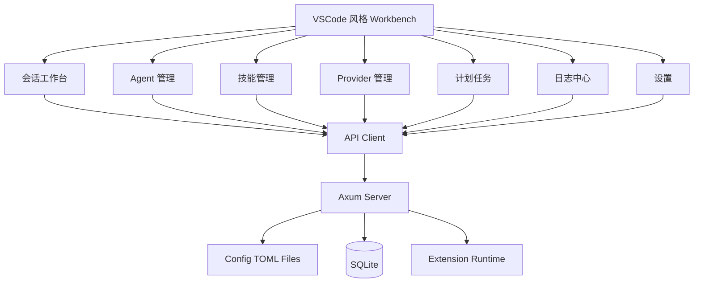

# 变更提案: platform-workbench-total-refactor

## 元信息
```yaml
类型: 重构
方案类型: implementation
优先级: P0
状态: 已确认
创建: 2026-04-21
```

---

## 1. 需求

### 背景
`Ennoia` 当前已经有基础的会话、任务、扩展、日志和运行时配置骨架，但产品结构与实际实现严重错位：

- README 与前端实现不一致
- 会话仍停留在“私聊 / 群聊双入口 + 目标输入框 + 占位式 delegation”的半成品状态
- Agent 只能查看，不能 CRUD，也缺少系统提示词、技能、思考等级等核心配置
- 技能与扩展边界模糊，Provider 还没有成为独立系统能力
- 计划任务、运行时配置、日志、扩展管理均偏底层实现导向，而不是可用产品导向
- Windows 路径展示、`.env.example` 和初始化目录行为也存在明显不一致

用户已经明确要求：不考虑兼容性、分阶段和实现难度，直接对整个工作台进行一次性重构落地。

### 目标
- 将工作台重构为以 `会话工作台` 为主入口的 VSCode 风格多面板系统
- 重建会话、消息流、Agent、技能、扩展、Provider、任务、日志、设置的清晰边界
- 实装 Agent / 技能 / Provider 的独立配置与管理 API
- 把聊天输入升级为统一多 Agent 会话 + `@agent` 路由模型
- 把运行时配置升级为表单化设置页，保留高级 JSON 模式
- 把日志升级为可搜索、可过滤、可统一查看前后端事件的真实日志中心
- 修正 Windows/macOS/Linux 路径展示、初始化目录生成和示例文档

### 约束条件
```yaml
时间约束: 不以开发时长为优先，允许一次性重构
性能约束: 保持本地单机运行，不引入外部基础设施依赖
兼容性约束: 不保留旧信息架构和旧心智模型
业务约束: 扩展与技能必须完全分离；本轮不设计 handoff_constraints 静态约束模型
```

### 验收标准
- [ ] 工作台重构为统一新建会话入口，1 个 Agent 自动单会话，2+ Agent 自动多会话
- [ ] 聊天输入框删除“目标”，支持 `@agent` 路由，多 Agent 消息流可展开查看运行轨迹
- [ ] Agent 支持完整 CRUD，字段以 `system_prompt / provider / model / reasoning_effort / workspace_root / skills / enabled` 为核心
- [ ] 技能与扩展完全分离：新增技能管理页，扩展页仅展示系统插件能力
- [ ] Provider 成为独立可配置对象，默认支持 OpenAI 类型
- [ ] 日志页支持搜索、等级/来源过滤，并纳入前端日志上报
- [ ] 计划任务重构为 `AI 任务 / 命令任务` 两类，支持超时、运行后删除、完成后投递到会话
- [ ] 运行时配置默认表单化，保留高级 JSON 模式
- [ ] `.env.example`、运行目录文档和 UI 路径展示修正为平台感知
- [ ] `cargo fmt --all`、`cargo check --workspace`、`cargo test --workspace`、`bun run --cwd web typecheck`、`bun run --cwd web build` 通过

---

## 2. 方案

### 技术方案
采用“前后端共同重构、UI 与模型同步更新”的整体替换方案：

1. **后端模型与接口重构**
   - 扩展 `AgentConfig`，新增系统提示词、Provider、思考等级、技能绑定等字段
   - 新增 `SkillConfig` 与 `ProviderConfig` 配置模型，走配置文件持久化
   - 新增 Agent / Skill / Provider 的 CRUD API
   - 扩展日志系统，支持前端日志写入与统一查询
   - 扩展任务模型，让 UI 能表达 `AI 任务 / 命令任务 / 超时 / 删除 / 投递会话`

2. **Web 工作台重构**
   - 用 VSCode 风格工作台替换当前“页面列表式”结构
   - 重构路由为 `工作台 / Agent / 技能 / 扩展 / 任务 / Provider / 日志 / 设置`
   - 用统一的消息事件流视图替换旧的聊天详情页
   - 用统一的表单、状态标签、面板和过滤器替换旧页面样式

3. **运行目录与模板修正**
   - 扩展运行目录结构，新增 `config/providers`、`config/skills`
   - 初始化时自动创建默认 Agent / Skill / Provider 相关目录和模板
   - 调整路径展示逻辑，Windows 显示真实绝对路径，Unix 系显示标准绝对路径
   - 修正 `.env.example` 与文档示例

4. **文档同步**
   - 更新 README、架构、运行目录、API 边界与开发文档
   - 把新的领域边界和页面结构同步为项目文档事实

### 影响范围
```yaml
涉及模块:
  - crates/kernel: Agent/Skill/Provider 配置模型扩展
  - crates/paths: 运行目录结构与路径展示修正
  - crates/server: Agent/Skill/Provider/Log/Task 新接口与会话行为改造
  - crates/scheduler: 任务类型表达增强
  - crates/assets: 初始化模板与迁移补充
  - web/packages/api-client: 新 API 类型与请求函数
  - web: 路由、工作台、页面、样式全面重构
  - docs 与 README: 结构、路径、功能说明全面同步
预计变更文件: 35-60
```

### 风险评估
| 风险 | 等级 | 应对 |
|------|------|------|
| 后端改动横跨配置、日志、任务、会话和初始化逻辑 | 高 | 以“新增接口 + 旧实现可并存但不再暴露”为策略，保持编译链稳定 |
| Web 全量改版易引入类型和样式回归 | 高 | 统一重写路由、布局和样式，最后用 typecheck/build 整体收口 |
| 前端日志统一上报需要数据库与 API 配套 | 中 | 采用最小正式实现：新表 + 新接口 + 全局 error/rejection 钩子 |
| 任务真实执行链仍然有限 | 中 | 先把任务模型、UI 和 API 做成正式版，已有调度能力继续承接运行 |

---

## 3. 技术设计

### 架构设计


### API设计
#### GET `/api/v1/agents`
- **请求**: 无
- **响应**: `AgentConfig[]`

#### POST `/api/v1/agents`
- **请求**: `AgentConfig`
- **响应**: `AgentConfig`

#### GET `/api/v1/skills`
- **请求**: 无
- **响应**: `SkillConfig[]`

#### POST `/api/v1/skills`
- **请求**: `SkillConfig`
- **响应**: `SkillConfig`

#### GET `/api/v1/providers`
- **请求**: 无
- **响应**: `ProviderConfig[]`

#### POST `/api/v1/providers`
- **请求**: `ProviderConfig`
- **响应**: `ProviderConfig`

#### POST `/api/v1/logs/frontend`
- **请求**: `FrontendLogPayload`
- **响应**: `204 No Content`

#### GET `/api/v1/logs`
- **请求**: `q?`、`level?`、`source?`、`limit?`
- **响应**: `LogRecord[]`

### 数据模型
| 字段 | 类型 | 说明 |
|------|------|------|
| `AgentConfig` | Rust/TS 共享 | Agent 最小正式配置对象 |
| `SkillConfig` | Rust/TS 共享 | 技能定义，独立于扩展 |
| `ProviderConfig` | Rust/TS 共享 | AI 上游定义 |
| `WorkbenchSession` | 前端结构 | 用于工作台渲染的会话聚合视图 |
| `FrontendLogPayload` | 后端接口 | 前端日志写入请求 |

---

## 4. 核心场景

### 场景: 统一新建会话
**模块**: workbench / server
**条件**: 系统已有多个 Agent
**行为**: 用户从统一入口多选 Agent，创建会话并开始发送消息
**结果**: 1 个 Agent 创建单会话，2+ Agent 创建多会话，消息可通过 `@agent` 指定目标

### 场景: Agent 与技能分离管理
**模块**: agents / skills / server
**条件**: 用户进入 Agent 与技能页面
**行为**: 编辑 Agent 的系统提示词、模型、思考等级、工作区与技能绑定；独立创建/编辑技能定义
**结果**: Agent 管理与技能管理边界清晰，技能不再混入扩展页

### 场景: 统一日志中心
**模块**: logs / observability / server
**条件**: 前后端均产生运行事件
**行为**: 前端将运行时错误上报后端，日志页统一检索前端与后端日志
**结果**: 用户可从一个入口搜索和过滤前后端事件

### 场景: 两类计划任务
**模块**: tasks / scheduler / server
**条件**: 用户创建计划任务
**行为**: 在任务页选择 AI 任务或命令任务，配置超时、完成后删除和会话投递
**结果**: 计划任务与产品心智一致，不再要求用户手写裸 payload JSON

---

## 5. 技术决策

### platform-workbench-total-refactor#D001: 用“工作台 + 配置对象 + 独立管理页”替换当前演示式信息架构
**日期**: 2026-04-21
**状态**: ✅采纳
**背景**: 当前页面是分散的演示页，无法承载会话工作流、管理能力和扩展插槽。
**选项分析**:
| 选项 | 优点 | 缺点 |
|------|------|------|
| A: 在旧页面上持续补字段和按钮 | 变更小 | 结构继续混乱，用户痛点无法根治 |
| B: 直接替换为 VSCode 风格工作台 | 一次性统一会话、面板、管理页和扩展能力 | 需要整套页面重写 |
**决策**: 选择方案 B
**理由**: 用户要求一次性重构，旧结构已经不值得继续缝补。
**影响**: `web` 路由、页面和样式体系整体替换

### platform-workbench-total-refactor#D002: 技能与扩展彻底分离，分别建模
**日期**: 2026-04-21
**状态**: ✅采纳
**背景**: 用户明确指出技能与扩展不是一回事，现有设计必须纠正。
**选项分析**:
| 选项 | 优点 | 缺点 |
|------|------|------|
| A: 继续把技能混在扩展页里 | 复用现有页面 | 语义错误，长期更乱 |
| B: 技能单独建模，扩展保持系统插件职责 | 边界清晰，UI 与数据模型一致 | 要新增配置对象与管理页 |
**决策**: 选择方案 B
**理由**: 技能服务 Agent，扩展服务系统，职责不同不能混。
**影响**: 新增 Skill 配置模型、API 和页面

### platform-workbench-total-refactor#D003: Agent 只保留真正可执行的配置字段
**日期**: 2026-04-21
**状态**: ✅采纳
**背景**: `role/profile/artifacts_dir/temp_dir/handoff_constraints` 等字段要么冗余，要么违背用户本轮设计要求。
**选项分析**:
| 选项 | 优点 | 缺点 |
|------|------|------|
| A: 继续沿用旧字段并在 UI 隐藏 | 修改少 | 实际模型继续污染 |
| B: 把 Agent 收敛为 prompt、provider、model、reasoning、workspace、skills | 更符合产品真实能力边界 | 需要重写模板与 API |
**决策**: 选择方案 B
**理由**: Agent 应是“可配置协作者”，不是冗余字段的集合。
**影响**: `AgentConfig`、默认模板、Agent 页和 API 全部调整

---

## 6. 成果设计

### 设计方向
- **美学基调**: 深色工程控制台 + 编辑器工作台，强调秩序感、状态感和多面板工作流
- **记忆点**: 类 VSCode 的左栏 / 主区 / 右栏 / 底部面板四区结构，以及会话时间线与运行轨迹并置
- **参考**: VSCode、Linear、运维控制台式多面板布局，但视觉上保持 Ennoia 深色工作台气质

### 视觉要素
- **配色**: 以深黑蓝背景、冷色主强调、少量亮色状态标签为基础；设置页保留浅色方案入口
- **字体**: 继续使用系统字体栈，重点提升信息层级与卡片节奏
- **布局**: 一级导航图标化，左侧列表，中心主内容，右侧详情，底部工具/日志面板
- **动效**: 轻量 hover、active、panel 切换过渡，不做花哨动画
- **氛围**: 使用半透明面板、细边框、微弱高光和状态色条构建“运行中的控制台”氛围

### 技术约束
- **可访问性**: 键盘可访问、对比度足够、状态标签有文本语义
- **响应式**: 桌面优先；窄屏退化为单列折叠布局
