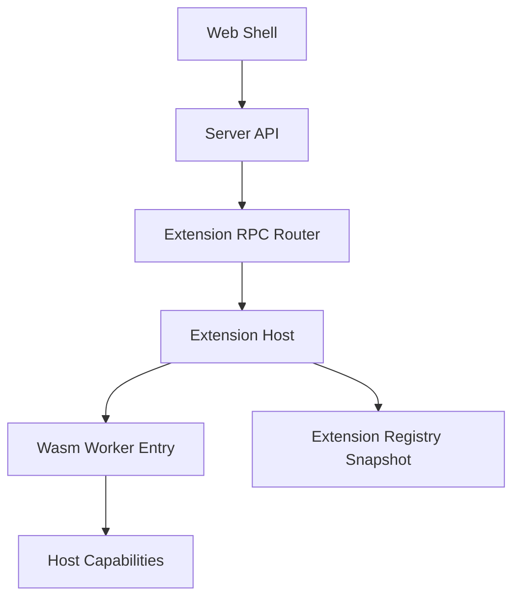

# 变更提案: wasm-extension-runtime

## 元信息
```yaml
类型: 架构重构
方案类型: implementation
优先级: P0
状态: 执行中
创建: 2026-04-23
```

---

## 1. 需求

### 背景
当前扩展后端通过 `backend.command` 启动独立进程，并依赖 `base_url` 与私有端口暴露能力。这使扩展更像独立程序，增加端口占用、进程编排、跨平台 shell 差异和权限边界复杂度。

### 目标
- 将扩展定义为能力包，而不是传统前后端服务。
- 使用可选 `ui` 与可选 `worker` 声明替代 `frontend` 与 `backend` 命名。
- 废弃扩展私有端口、`backend.command` 和子进程 Runner。
- 建立 `Rust Host + Wasm Worker + Capability` 的单一长期扩展模型。
- 提供统一 RPC 入口，让能力调用由宿主分发到 Worker。

### 约束条件
```yaml
兼容性约束: 不保留旧 process runner 和端口代理作为长期路径
业务约束: 内置扩展 manifest、文档和 API 表述必须同步切换到能力包模型
工程约束: 保持 Rust workspace 可检查，避免引入无法快速验证的大型运行时依赖
```

### 验收标准
- [ ] Kernel 扩展模型支持 `ui`、`worker`、`permissions`、`runtime`，并移除端口/命令型后端主路径。
- [ ] Extension Host 不再启动扩展子进程，快照按 Wasm Worker 解析能力包。
- [ ] Server 提供统一扩展 RPC 入口，并让 behavior/memory 能力调用走 Worker RPC 分发。
- [ ] 内置扩展 descriptor 改为新版能力包协议。
- [ ] 架构、运行目录、扩展开发和 API 文档同步更新。
- [ ] `cargo fmt --all`、`cargo check --workspace` 至少完成验证。

---

## 2. 方案

### 技术方案
采用单一目标架构：`Rust Host` 保持原生，扩展包可声明 `ui` 和 `worker`。`worker.kind = "wasm"` 是唯一推荐执行单元，宿主负责解析、生命周期、权限、日志、RPC 和未来 capability 注入。当前改造先落地协议、解析、状态、统一 RPC 与端口模型删除，Worker 执行层保留明确 ABI 边界。

### 影响范围
```yaml
涉及模块:
  - crates/kernel: 扩展 manifest、Worker、权限、运行时和 RPC 类型
  - crates/extension-host: 扩展解析、快照、Worker 解析、子进程 Runner 删除
  - crates/server: 统一 RPC 路由、behavior/memory 能力分发、旧代理移除
  - crates/assets: 内置扩展资源嵌入支持文本/二进制边界
  - crates/cli: 开发模式移除扩展前端命令托管和后端端口心智
  - builtins/extensions: descriptor 迁移到 `ui`/`worker`
  - docs: 架构和开发文档同步
预计变更文件: 15+
```

### 风险评估
| 风险 | 等级 | 应对 |
|------|------|------|
| 旧内置 memory/workflow 仍是 HTTP 服务实现 | 高 | 本次切断端口模型并保留 Worker RPC 错误边界，后续业务逻辑按 Wasm ABI 迁移 |
| 引入完整 Wasm runtime 导致验证成本过高 | 中 | 当前先定义 Runner/ABI 边界，不引入大型依赖；能力执行层可在下一轮接入 Wasmtime 或 Component Model |
| Web/API 仍引用旧字段 | 中 | 使用全仓搜索替换 `frontend/backend/base_url/command` 表述 |

---

## 3. 技术设计

### 架构设计


### API设计
#### POST /api/v1/extensions/{extension_id}/rpc/{method}
- **请求**: `{ "params": any, "context": object }`
- **响应**: `{ "ok": boolean, "data": any, "error": object|null }`

#### ANY /api/v1/behavior/{*path}
- **行为**: 解析 active behavior，转换为 Worker RPC method，再由宿主分发。

#### ANY /api/v1/memory/{memory_id}/{*path}
- **行为**: 解析 memory provider，转换为 Worker RPC method，再由宿主分发。

### 数据模型
| 字段 | 类型 | 说明 |
|------|------|------|
| ui.entry | Option<String> | 可选 UI 模块入口 |
| worker.kind | Option<String> | Worker 类型，当前目标为 wasm |
| worker.entry | Option<String> | Worker 文件入口 |
| worker.abi | Option<String> | ABI 标识，如 `ennoia.worker.v1` |
| permissions | ExtensionPermissionSpec | 默认全关的权限声明 |
| runtime.startup | lazy/eager | Worker 启动策略 |

---

## 4. 核心场景

### 场景: 扩展 UI 加载
**模块**: Server / Extension Host
**条件**: 扩展声明 `[ui] entry = "ui/entry.js"`
**行为**: 宿主解析 UI 入口并通过 `/api/v1/extensions/{extension_id}/ui/module` 返回模块内容
**结果**: UI 扩展按能力包挂载，不要求存在 Worker。

### 场景: 扩展 Worker RPC
**模块**: Server / Extension Host
**条件**: 扩展声明 `[worker] kind = "wasm"` 和 `entry`
**行为**: 请求进入 `/api/v1/extensions/{id}/rpc/{method}`，宿主校验 Worker 与权限后分发
**结果**: 扩展不需要端口和独立进程。

---

## 5. 技术决策

### wasm-extension-runtime#D001: 扩展系统采用能力包 + Wasm Worker
**日期**: 2026-04-23
**状态**: ✅采纳
**背景**: 端口型扩展增加架构复杂度，不符合长期插件/沙箱目标。
**选项分析**:
| 选项 | 优点 | 缺点 |
|------|------|------|
| A: 继续 process runner | 开发快，复用现有服务 | 端口、进程、权限边界复杂 |
| B: Rust Host + Wasm Worker | 能力边界清晰，长期沙箱友好 | 需要设计 ABI 与 capability |
| C: 全后端 Wasm 化 | 理论统一 | 宿主能力反而复杂，系统层收益低 |
**决策**: 选择方案 B。
**理由**: Rust 适合做稳定宿主，Wasm 适合承载可插拔、不可信、跨平台的扩展能力。
**影响**: 扩展 manifest、运行时、API、文档和内置扩展声明全部切换到 Worker 模型。

---

## 6. 成果设计

N/A。该任务不包含视觉交付物。
