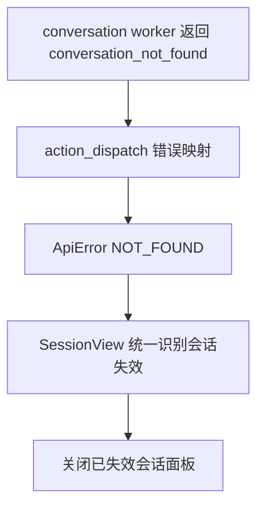

# 变更提案: conversation-not-found-fix

## 元信息
```yaml
类型: 修复
方案类型: implementation
优先级: P1
状态: 已确认
创建: 2026-05-07
```

---

## 1. 需求

### 背景
会话页面在请求一个已经失效或被删除的 conversation 时，页面会直接展示
`conversation_not_found: conversation not found`。当前链路里，扩展 worker 已经返回了明确的
业务错误码，但动作分发层把它统一包装成 `bad_request`，前端又只按 `404` 判断是否应关闭当前面板，
导致页面拿不到稳定的业务语义。

### 目标
修复会话页的异常处理链路，让“会话不存在”能够被后端稳定表达，并被前端稳定识别，
从而自动关闭或回收失效会话面板，而不是直接暴露底层错误字符串。

### 约束条件
```yaml
时间约束: 本次仅修复会话不存在相关链路
性能约束: 不增加额外请求轮次
兼容性约束: 保持现有 action dispatch 与 ApiError 结构兼容
业务约束: 不改变正常会话读写与分支操作行为
```

### 验收标准
- [ ] `conversation_not_found` 不再被统一压成普通 bad request
- [ ] 会话页在加载、刷新、发消息、分支操作等入口遇到“会话不存在”时能统一回收失效面板
- [ ] 相关 Rust/前端代码通过基础格式化与检查

---

## 2. 方案

### 技术方案
分两层修复：

1. 后端在动作分发层识别扩展 worker 返回的资源不存在错误，将
   `conversation_not_found`、`branch_not_found`、`lane_not_found`、`message_not_found`
   映射为 `ApiError::not_found`，保留稳定的 HTTP/业务语义。
2. 前端会话页新增统一的“会话已失效”错误判断逻辑，优先根据 `ApiError.code`
   与消息内容识别业务错误，再用 `404` 作为兜底，复用到 hydrate、refresh、
   submitDraft、switchBranch、saveBranchName、removeBranch 等入口。

### 影响范围
```yaml
涉及模块:
  - server actions route: 保留扩展错误语义
  - web conversation session: 统一识别并回收失效会话
  - knowledge base: 记录本次修复
预计变更文件: 5
```

### 风险评估
| 风险 | 等级 | 应对 |
|------|------|------|
| not found 映射过宽，影响其他 action 报错 | 中 | 仅对明确的 *_not_found 错误码做映射 |
| 前端误判普通错误为会话失效 | 中 | 先判稳定业务码，再以消息关键字和 404 兜底 |
| 分支/消息操作链路处理不一致 | 低 | 统一抽成 helper 并复用到各异步入口 |

---

## 3. 技术设计（可选）

### 架构设计


### API设计
#### POST /api/actions/{action}
- **请求**: 保持现有 action dispatch 结构
- **响应**: 当扩展返回 `conversation_not_found` 等明确 not found 错误时，返回 `NOT_FOUND`

---

## 4. 核心场景

### 场景: 已删除会话重新打开
**模块**: web conversations
**条件**: 工作台仍保留已删除会话 panel
**行为**: SessionView 请求 `conversation.get`
**结果**: 前端识别为会话已失效并关闭 panel，不直接展示底层错误

### 场景: 会话打开期间被其他入口删除
**模块**: server actions + web conversations
**条件**: 当前会话已打开，随后会话记录被删除
**行为**: 用户继续发送消息或执行分支操作
**结果**: action 返回 not found，SessionView 统一回收失效会话

---

## 5. 技术决策

### conversation-not-found-fix#D001: 业务错误语义优先于单纯 HTTP 状态判断
**日期**: 2026-05-07
**状态**: ✅采纳
**背景**: 前端只依赖 `404`，而动作网关会抹平扩展错误语义，导致 UI 无法恢复
**选项分析**:
| 选项 | 优点 | 缺点 |
|------|------|------|
| A: 只改前端，继续依赖字符串匹配 | 改动小 | 语义脆弱，后端仍然错误包装 |
| B: 后端保留 not found 语义，前端按业务错误码优先识别 | 语义稳定，前后端职责清晰 | 需要双端同步修改 |
**决策**: 选择方案 B
**理由**: 既修复当前页面问题，也让后续类似资源失效错误有统一表达方式
**影响**: `crates/server/src/routes/actions.rs`、`web/src/views/conversations/Session.tsx`

---

## 6. 成果设计

N/A，本次为非视觉修复任务。
