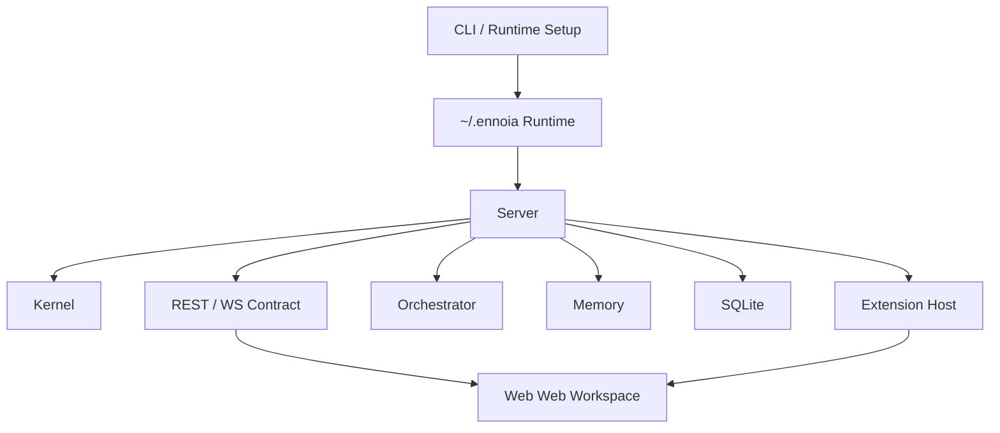

# 变更提案: platform-first-full-rollout

## 元信息
```yaml
类型: 新功能
方案类型: implementation
优先级: P0
状态: 已确认
创建: 2026-04-15
```

---

## 1. 需求

### 背景
`Ennoia` 当前已经具备可运行骨架：Rust workspace、SQLite、基础 API、主壳页面、extension registry 和运行目录模板都已存在。但这些能力大多还停留在骨架级或 plan 级联通，尚未形成“正式产品面 + 平台基础设施 + 质量闭环”统一完成态。

用户希望这次不是补一个可演示闭环，而是一次性制定并推进完整方案，最终把首版正式产品和平台能力都开发出来。用户已明确选择“平台基础设施优先”，要求按阶段推进，但整体目标是在同一轮规划内覆盖全部核心能力，并能够最终一次性完成。

### 目标
- 以平台基础设施为先导，完成 `extension-host / runtime / cli / packaging / testing / CI` 的正式化建设
- 在第二阶段完成 `thread / message / run / task / memory` 的正式领域模型、存储模型和 API
- 在第三阶段完成 `web` 正式工作台、extension page/panel 挂载和核心产品交互
- 形成一套可持续开发的首版系统，而不是仅用于演示的临时闭环
- 为后续真实 provider、实时流、更多系统 extension 接入打下稳定边界

### 约束条件
```yaml
时间约束: 方案需支持“一次性推进完成”，但必须按依赖拆分阶段执行
性能约束: 首版仍以单机 SQLite 和本地运行目录为基础，不引入远程数据库
兼容性约束: 保持 Rust workspace + React/Vite/Bun + Panda CSS 现有技术栈
业务约束: 本轮覆盖正式产品面与平台基础设施，但不强行纳入真实 LLM/provider 执行与生产级多节点部署
```

### 验收标准
- [ ] CLI、runtime 模板、packaging、extension 安装位和 CI 形成可用平台基础
- [ ] `thread / message / run / task / memory / extension contribution` 领域模型和 SQLite schema 正式化
- [ ] `server` 暴露完整 REST API，私聊、群聊、run/task、memory、extension 均可真实读写与查询
- [ ] `web` 成为正式工作台，包含会话区、运行区、记忆区和 extension page/panel 容器
- [ ] `tests/integration` 与 `tests/e2e` 不再为空壳，CI 可执行关键验证链
- [ ] 文档、模板、实现保持一致，形成首版长期可持续开发起点

---

## 2. 方案

### 技术方案
采用“平台基础设施优先”的三阶段总体推进方案：

1. Phase 1 先完成平台底座正式化：
   - 统一 extension 安装/扫描/注册协议
   - 强化 CLI `init/dev/start`
   - 补运行目录模板、npm 打包入口、CI 和测试基建
   - 为后续 conversation 和 web 建立稳定基础
2. Phase 2 完成正式领域层：
   - 新增并落地 `thread / message`
   - 完善 `run / task` 生命周期与状态流
   - 规范 `memory` 回写与召回
   - 统一 server repository/service/API 分层
3. Phase 3 完成正式产品面：
   - `web` 重构为工作台结构
   - 支持私聊、群聊、run/task、memory 面板
   - 接入 extension page/panel mount contract
   - 完成 integration/e2e 与最终文档收口

最终目标不是阶段性交差，而是在同一轮实施中把三阶段全部推进完成；阶段只是依赖顺序，不是范围缩减。

### 影响范围
```yaml
涉及模块:
  - crates/kernel: 正式领域模型与契约
  - crates/extension-host: extension registry、扫描协议、挂载元数据
  - crates/server: schema、repository/service、REST API、runtime bootstrapping
  - crates/orchestrator: 私聊/群聊 run-task 生命周期
  - crates/memory: recall/remember/context assembly 规范化
  - crates/cli: init/dev/start/runtime setup 正式化
  - web: 正式 workspace、conversation 页面、panel 容器、extension mount
  - packaging/home-template: runtime 模板与默认扩展内容
  - packaging/npm: 发布入口
  - tests: integration/e2e 基建与链路验证
  - docs: architecture/data-model/api/runtime/extension-development 同步更新
预计变更文件: 30+
```

### 风险评估
| 风险 | 等级 | 应对 |
|------|------|------|
| Phase 1 过重导致产品面延后 | 中 | 明确基础设施只做到服务后续阶段所需的“正式可用”边界，不扩张到生产级部署 |
| 领域模型与现有骨架差异较大 | 高 | 在 Phase 2 集中完成 schema 与 service 分层重构，避免 Phase 3 返工 |
| web 重构时 UI 与后端协议耦合 | 中 | 在 Phase 2 先冻结 REST contract 和 extension mount contract |
| 一次性推进范围过大 | 高 | 通过阶段验收和任务依赖控制执行顺序，确保每阶段结束后都可验证 |

---

## 3. 技术设计

### 架构设计


### 领域模型补全方向

- 新增正式 `Thread`、`Message` 存储层
- `RunStatus`、`TaskStatus` 扩展到完整生命周期
- `ExtensionManifest` 增加前端挂载协议需要的最小元数据
- `ContextView` 从“owner 摘要”升级为“conversation + active run + recalled memory” 组合视图

### API 设计方向

- Conversation:
  - `GET /api/v1/threads`
  - `GET /api/v1/threads/:id/messages`
  - `POST /api/v1/threads/private`
  - `POST /api/v1/threads/space`
- Runs / Tasks:
  - `GET /api/v1/runs/:id`
  - `GET /api/v1/tasks?run_id=...`
  - `POST /api/v1/runs/:id/start`
  - `POST /api/v1/tasks/:id/transition`
- Memory:
  - `GET /api/v1/memories?owner_kind=...&owner_id=...`
  - `POST /api/v1/memories`
- Extensions:
  - `GET /api/v1/extensions/registry`
  - `GET /api/v1/extensions/pages`
  - `GET /api/v1/extensions/panels`

### Web 设计方向

- 左侧导航：私聊、群聊、Runs、Memory、Extensions
- 主区：conversation workspace
- 右侧/底部面板：run inspector、task list、memory summary、extension panels
- 动态挂载：依据 extension registry 生成 page route 与 panel slot

---

## 4. 分阶段实施方案

### Phase 1：平台基础设施正式化

- `extension-host`
  - extension 扫描与 registry 数据结构标准化
  - 统一 page/panel/command/hook/provider 输出协议
- `cli`
  - `init` 生成完整 runtime 目录
  - `dev` 启动初始化与 server bootstrap
  - `start/serve` 对齐正式运行入口
- `packaging`
  - 校正 npm 打包入口与模板目录
  - home-template 字段与 docs 同步
- `tests / CI`
  - 建 integration/e2e 目录实际入口
  - CI 增加 web typecheck 与 smoke build

验收：
- `cli init/dev/start` 可用
- runtime template 与 docs 一致
- extension registry 输出稳定
- CI 可跑基础链路

### Phase 2：领域与后端正式化

- `kernel`
  - 补充 thread/message/run/task/memory/extension 领域对象
- `server`
  - SQLite schema 升级
  - repository/service/router 分层
  - 私聊/群聊/thread/message/run/task/memory API 完整化
- `orchestrator`
  - run/task 生命周期流转
  - 私聊与群聊共享 planning/execution contract
- `memory`
  - recall/remember/context assembly 正式化

验收：
- 私聊与群聊数据从 thread/message 开始真实持久化
- run/task 有明确生命周期
- memory 可按 owner 与 thread 召回
- integration tests 覆盖关键 API

### Phase 3：产品工作台正式化

- `web`
  - conversation 页面
  - group space 页面
  - run/task/memory 面板
  - extension page/panel 动态挂载容器
- `web/builtins` / `web/ui-sdk`
  - 为内建页面和 extension mount 预留正式接入点
- `tests/e2e`
  - 覆盖私聊发起、run 生成、memory 展示、extension 页面挂载
- `docs`
  - 同步 API、架构、扩展开发和运行时文档

验收：
- web 成为正式 workspace
- 私聊/群聊/运行状态/记忆/扩展挂载全链路可视化
- e2e 可验证核心主链路
- 文档与模板完成收口

---

## 5. 核心场景

> 执行完成后同步到对应模块文档

### 场景: 私聊正式链路
**模块**: server / orchestrator / memory / web
**条件**: 用户已进入私聊工作台并选择 Agent
**行为**: 发送消息 -> 创建 thread/message -> 触发 run/task -> 组装 context -> 回写 memory -> web 展示
**结果**: 用户看到完整私聊历史、run 状态、task 状态和 memory 摘要

### 场景: 群聊正式链路
**模块**: server / orchestrator / web
**条件**: 用户进入某个 Space
**行为**: 发送空间消息 -> 生成 space thread/run/task 集 -> web 展示群聊与协作状态
**结果**: Space 页面能查看群聊上下文和执行状态

### 场景: Extension 页面与面板挂载
**模块**: extension-host / web
**条件**: runtime 中已安装并启用某个 system extension
**行为**: server 输出 registry -> web 动态注册 page/panel -> 用户进入对应页面或打开面板
**结果**: extension 贡献不再只是列表数据，而是正式挂载到工作台

---

## 6. 技术决策

> 本方案涉及的技术决策，归档后成为决策的唯一完整记录

### platform-first-full-rollout#D001: 采用平台基础设施优先的全量推进方案
**日期**: 2026-04-15
**状态**: ✅采纳
**背景**: 用户要求“全部都做”，但又明确希望这是正式开发而不是 demo，需要一个既能全覆盖又能控制依赖顺序的方案。
**选项分析**:
| 选项 | 优点 | 缺点 |
|------|------|------|
| A: 领域先行 | 后端边界最稳 | 平台与交付层补得太晚 |
| B: 产品面先行 | 可见成果最快 | 最容易为了页面快速联通而牺牲长期规范 |
| C: 平台基础设施优先 | 可把 runtime、extension、CLI、testing、CI 一次打成稳定底座，后续两阶段更顺 | 第一阶段产品感较弱，需要接受先搭底座 |
**决策**: 选择方案 C
**理由**: 用户明确选择 C，并强调不是为了闭环演示，而是为了正式完整开发；平台基础设施优先更符合这一目标。
**影响**: 本轮规划会优先修改 CLI、runtime template、extension-host、packaging、tests、CI，再进入领域和产品面

---

## 7. 成果设计

> 含视觉产出的任务由 DESIGN Phase2 填充。非视觉任务整节标注"N/A"。

### 设计方向
- **美学基调**: 温暖纸感工作台升级为正式 AI 作业台，保持编辑台气质，同时引入更明确的信息层级
- **记忆点**: 会话区 + 运行面板 + 扩展面板同屏协作的工作台结构
- **参考**: 延续当前 web 的纸感与毛玻璃方向，但升级为真正的 workspace 布局

### 视觉要素
- **配色**: 米色背景 + 墨色主文字 + 铜色标识 + 冷色状态提示
- **字体**: 标题保留衬线展示字，正文使用清晰无衬线，形成工作区与内容区区分
- **布局**: 左侧导航 + 中间会话主区 + 右侧运行/记忆/扩展面板
- **动效**: 状态切换和面板挂载使用克制过渡，避免夸张动画影响工作感
- **氛围**: 背景光斑、卡片层次、轻阴影和半透明叠层提升纵深

### 技术约束
- **可访问性**: 面板、会话项和表单控件具有清晰 focus 状态与语义结构
- **响应式**: 小屏下主区与面板区可折叠或纵向堆叠
