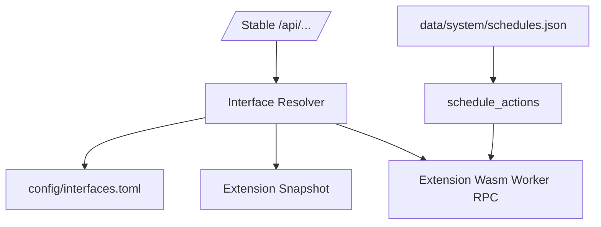

# 变更提案: wasm-action-interface-scheduler

## 元信息
```yaml
类型: 架构重构
方案类型: implementation
优先级: P0
状态: 已完成
创建: 2026-04-23
```

## 1. 需求

### 背景

当前核心内置 `journal` 作为保底会话存储，会让系统边界变厚；同时 `memory` / `workflow` 这类大块能力不足以表达“会话列表、创建会话、写消息、读取任务”等更具体的系统动作。用户希望扩展仍统一称为扩展，核心只保留必要接口、绑定和基础调度。

### 目标

- 删除核心 `journal` 配置、路径、锁和路由。
- 新增细粒度 `interfaces` 贡献，让稳定 `/api/...` 动作绑定到扩展 Wasm Worker method。
- 新增 `schedule_actions` 贡献和系统 scheduler，让定时器作为共享基础设施触发扩展动作。
- 内置 `memory` 扩展提供会话、线路、消息接口；内置 `workflow` 扩展提供 run/task/artifact 接口和 `workflow.run` 定时动作。
- 前端 API 类型、文档和知识库同步新的无 `/api/v1`、Wasm Worker 扩展协议。

### 约束条件

```yaml
API约束: 后端路径统一为 /api/...，不引入 /api/v1
扩展约束: 执行单元是 Wasm Worker，不是独立后端服务
系统边界: 核心只维护接口绑定、计划、触发和系统日志，不内置业务存储
兼容约束: behavior/memory 旧能力入口暂保留，主路径转向细粒度 interfaces
```

### 验收标准

- [x] 核心不再暴露 `journal` 路由、配置和运行目录。
- [x] `/api/conversations` 与 `/api/runs` 通过接口绑定进入扩展 Worker。
- [x] `/api/schedules` 能创建、更新、暂停、恢复、手动运行并由后台 tick 触发。
- [x] 扩展 runtime snapshot 暴露 `interfaces` 与 `schedule_actions`。
- [x] 文档、README、知识库与 API client 同步。

## 2. 方案

### 技术方案

- 在 `kernel` manifest 中新增 `InterfaceContribution`、`ScheduleActionContribution` 和 `InterfaceBindingsConfig`。
- 在 `extension-host` snapshot 中展开注册后的接口实现和定时动作，Worker 授权前缀纳入 `method`。
- 在 `server` 新增 `routes/interfaces.rs` 和 `routes/schedules.rs`：
  - interface resolver 先读 `config/interfaces.toml`，否则单实现自动绑定，多实现报冲突。
  - stable API handler 只负责参数转发、Hook 派发和错误包装。
  - scheduler 使用 `data/system/schedules.json` 存储计划，后台每秒扫描 due schedules。
- 在内置 `memory` / `workflow` extension manifest 中声明具体接口和定时动作，并补齐 Wasm Worker 示例响应。
- 在 Web API client 中新增 `interfaces.ts` 和 `schedules.ts`。

### 影响范围

```yaml
涉及模块:
  - kernel: manifest 和配置模型
  - extension-host: runtime snapshot 与 Worker method 授权
  - server: API 路由、接口绑定、scheduler、journal 删除
  - builtins/extensions: memory/workflow manifest 与 worker
  - web/packages: runtime 类型和 API client
  - docs/.helloagents: 架构、API、运行目录、扩展开发和知识库
预计变更文件: 30+
```

### 风险评估

| 风险 | 等级 | 应对 |
|------|------|------|
| 删除 journal 后内置 memory Worker 暂无真实持久化 | 中 | 明确核心不内置业务存储；后续通过 host storage/sqlite capability bridge 或扩展私有持久化实现补齐 |
| 多扩展同时实现同一接口时 API 无法自动选择 | 中 | 返回 conflict，并通过 `config/interfaces.toml` 显式绑定 |
| cron 未实现完整表达式解析 | 低 | 当前要求 payload 提供 `next_run_at`，后续可接入 cron parser |

## 3. 技术设计

### 架构设计



### API 设计

- `GET /api/extensions/interfaces`
- `GET /api/extensions/schedule-actions`
- `GET /api/interfaces`
- `GET /api/interfaces/bindings`
- `PUT /api/interfaces/bindings`
- `POST /api/runs`
- `GET /api/runs/{run_id}`
- `GET /api/conversations/{conversation_id}/runs`
- `GET /api/runs/{run_id}/tasks`
- `GET /api/runs/{run_id}/artifacts`
- `GET /api/schedule-actions`
- `GET|POST /api/schedules`
- `GET|PUT|DELETE /api/schedules/{schedule_id}`
- `POST /api/schedules/{schedule_id}/run|pause|resume`

### 数据模型

| 字段 | 类型 | 说明 |
|------|------|------|
| `InterfaceContribution.key` | string | 系统动作键 |
| `InterfaceContribution.method` | string | 扩展 Worker RPC method |
| `ScheduleActionContribution.id` | string | 定时动作 ID |
| `ScheduleRecord.trigger` | enum | `once` / `interval` / `cron` |
| `ScheduleRecord.target` | object | `extension_id` + `action_id` |

## 4. 核心场景

### 场景: 前端进入新会话读取数据
**模块**: server/interfaces
**条件**: memory 扩展声明 `conversation.get`、`message.list`、`lane.list_by_conversation`
**行为**: `/api/conversations/{id}` 和消息/线路 API 通过接口绑定调用 memory Worker
**结果**: 前端不关心具体 memory 实现，只依赖稳定 `/api/...`

### 场景: 用户添加定时器
**模块**: server/schedules
**条件**: workflow 扩展声明 `workflow.run`
**行为**: 用户创建 schedule，scheduler 到期调用 `workflow/schedules/run`
**结果**: 核心只负责触发，运行语义由 workflow 扩展实现

## 5. 技术决策

### wasm-action-interface-scheduler#D001: 采用薄系统接口绑定 + Wasm Worker 动作实现
**日期**: 2026-04-23
**状态**: ✅采纳
**背景**: 用户不希望系统以内置 `journal`、`memory`、`workflow` 大块能力承担过多业务，但会话、消息、运行和定时动作又需要稳定系统入口。
**选项分析**:
| 选项 | 优点 | 缺点 |
|------|------|------|
| A: 保留 journal 作为兜底 | 前端立刻有持久化 | 核心边界变厚，与“扩展负责业务”冲突 |
| B: 只保留 memory/workflow 大块配置 | 改动小 | 无法表达细粒度替换和绑定 |
| C: 细粒度 interfaces + schedule_actions | 系统薄、动作具体、扩展独立 | 需要补接口绑定和扩展实现 |
**决策**: 选择方案 C。
**理由**: 既保留稳定 API，又避免核心持有业务语义；扩展可以只替换某个动作而不是替换整块 memory/workflow。
**影响**: kernel、extension-host、server、builtins、web API client、docs。

## 6. 成果设计

N/A：本次为后端架构和协议重构，不新增视觉产出。
