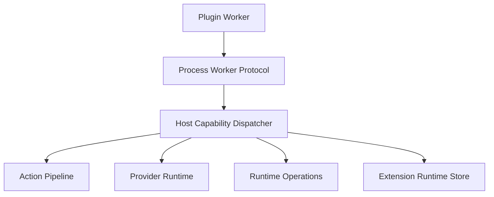

# 变更提案: plugin-host-capability-rpc

## 元信息
```yaml
类型: 重构
方案类型: implementation
优先级: P0
状态: 已完成
创建: 2026-05-08
```

---

## 1. 需求

### 背景
`workflow-service` 目前通过 `reqwest -> http://127.0.0.1:3710 -> host route -> host service` 的绕行方式访问宿主能力。
这导致插件进程与宿主进程之间多出一层本地 HTTP 依赖，错误会在“插件发请求”这一层提前失败，既破坏插件系统边界，也让 provider / action / runtime operation / extension state / extension record 这些宿主能力无法以统一协议复用。

### 目标
- 为插件系统提供平台级 `plugin -> host capability` 调用通道，而不是为 workflow 单独打补丁。
- 让 process worker 可以在当前 RPC 会话内向宿主发起能力调用，并复用宿主现有的权限、日志、trace、超时与错误模型。
- 将 `workflow-service` 从 localhost HTTP 回环迁移到新的 host capability 通道，彻底移除这条不稳定链路。

### 约束条件
```yaml
时间约束: 本次一次性完成协议、宿主 dispatcher 与 workflow 迁移
性能约束: 不新增额外本地 HTTP 往返；host call 必须在现有 worker RPC 超时约束内完成
兼容性约束: 不为旧 localhost 回环保留长期兼容层
业务约束: 不引入 workflow 专用宿主桥，不把 workflow 内置回 core
```

### 验收标准
- [ ] `workflow-service` 不再通过 `reqwest` 请求 `127.0.0.1:3710`
- [ ] 插件到宿主的能力调用通过统一协议覆盖 action、provider、runtime operation、extension state、extension record
- [ ] 宿主能力调用复用现有权限、trace、日志与错误返回模型
- [ ] `cargo fmt --all`、`cargo check --workspace`、`cargo test --workspace` 通过

---

## 2. 方案

### 技术方案
在 `kernel` 定义平台级 host capability DTO 与 process worker 控制消息协议；
在 `extension-host` 为 process worker 增加“worker 输出 host call 消息，宿主同步处理后回写 host result 消息”的双向 stdio 能力；
在 `server` 新增统一 host capability dispatcher，复用现有 action / provider / runtime operation / extension state / extension record 服务；
最后将 `workflow-service` 的 `HostApiClient` 重构为 `HostCapabilityClient`，通过新协议直接调用宿主能力。

### 影响范围
```yaml
涉及模块:
  - kernel: 新增插件到宿主能力调用协议 DTO
  - extension-host: process worker 双向 stdio 控制消息与 host dispatcher 接口
  - server: host capability dispatcher 与 provider 共享调用面
  - workflow-service: 移除 localhost HTTP client，迁移到 host capability client
  - docs / knowledge: 同步更新扩展运行时架构说明
预计变更文件: 12
```

### 风险评估
| 风险 | 等级 | 应对 |
|------|------|------|
| process worker 双向消息处理死锁 | 高 | 以单次 RPC 会话串行处理 host call / host result，并保持同一把 stdin/stdout 锁 |
| provider / runtime operation 权限链在新通道下失效 | 高 | dispatcher 直接复用现有授权函数与共享 helper，不重写策略 |
| workflow 改造后错误语义回归 | 中 | 保留 `HostApiError` / 对话错误格式化逻辑，仅替换底层传输 |
| route 与 host dispatcher 逻辑分叉 | 中 | 抽共享 helper，避免 provider 等逻辑复制两份 |

---

## 3. 技术设计（可选）

> 涉及架构变更、API设计、数据模型变更时填写

### 架构设计


### API设计
#### Host Capability Control Message
- **请求**: `ExtensionHostCapabilityCall { call_id, request }`
- **响应**: `ExtensionHostCapabilityResult { call_id, response }`

#### Host Capability Request
- **请求**: `ExtensionHostCapabilityRequest`
  - `action_dispatch`
  - `provider_invoke`
  - `runtime_operation`
  - `extension_state_get/put/delete`
  - `extension_record_append/update/close`
- **响应**: 统一复用 `ExtensionRpcResponse`

### 数据模型
| 字段 | 类型 | 说明 |
|------|------|------|
| `call_id` | `String` | 单次 worker -> host 能力调用关联 ID |
| `request` | `ExtensionHostCapabilityRequest` | 平台级宿主能力请求 |
| `response` | `ExtensionRpcResponse` | 宿主能力统一返回结构 |

---

## 4. 核心场景

> 执行完成后同步到对应模块文档

### 场景: workflow 会话回复触发模型调用
**模块**: extension runtime / workflow-service
**条件**: workflow process worker 正在处理 `conversation.message.created`
**行为**: worker 通过 host capability 通道请求 provider generate、message.list、runtime operation 等宿主能力
**结果**: 宿主直接在当前 RPC 会话内完成能力分发，worker 不再依赖 localhost HTTP

---

## 5. 技术决策

> 本方案涉及的技术决策，归档后成为决策的唯一完整记录

### plugin-host-capability-rpc#D001: 以平台级 host capability 协议替代插件 localhost HTTP 回环
**日期**: 2026-05-08
**状态**: ✅采纳
**背景**: workflow 当前通过 localhost HTTP 访问宿主能力，这条链路既不稳定，也绕开了插件系统本该提供的正式宿主调用面
**选项分析**:
| 选项 | 优点 | 缺点 |
|------|------|------|
| A: 保留 localhost HTTP，只补日志/重试 | 改动小 | 没有修复架构边界问题，故障点仍在 |
| B: 为 workflow 增加专用宿主桥 | 能解决当前问题 | 形成 workflow 特化接口，平台边界继续恶化 |
| C: 在插件系统中加入统一 host capability 通道 | 架构一致，所有 process worker 可复用，能复用现有宿主服务 | 需要改协议与 runtime |
**决策**: 选择方案 C
**理由**: 问题本质不是某条 provider 请求失败，而是插件系统缺正式的 plugin -> host 调用能力；因此必须在平台层补协议，而不是继续给 workflow 打旁路
**影响**: 影响 kernel、extension-host、server、workflow-service 与扩展运行时文档

---

## 6. 成果设计

> 含视觉产出的任务由 DESIGN Phase2 填充。非视觉任务整节标注"N/A"。

N/A
