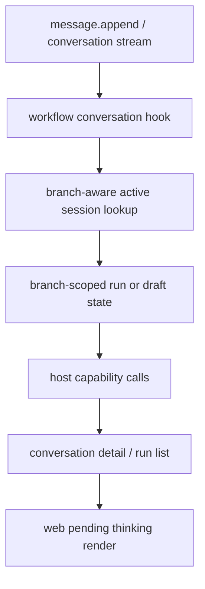

# 变更提案: branch-aware-agent-state-isolation

## 元信息
```yaml
类型: 修复/重构
方案类型: implementation
优先级: P0
状态: 已确认
创建: 2026-05-08
```

---

## 1. 需求

### 背景
- 当前会话存在三个相互关联的问题：
- `thinking` 状态在编辑消息后会残留到新分支，导致旧分支的处理中状态污染当前分支。
- 同一个 agent 在不同分支/子线中的 workflow 会共享一条进行中状态，出现跨分支阻塞和恢复串扰。
- 当某条 workflow 处理链卡住时，会进一步拖慢 `conversation.get`、`run.list` 等查询，最终放大为 API 健康探针超时、dev 守护重启和前端 `ECONNREFUSED/ECONNRESET`。

### 目标
- 将 workflow active session、待回复标记和恢复执行上下文统一提升为 branch-aware 状态模型。
- 确保分支编辑/改写后，新分支不会继承旧分支的 `thinking` 与执行中状态。
- 降低单条分支卡住时对同会话其他分支和会话查询接口的连带影响。

### 约束条件
```yaml
时间约束: 本次直接一次性重构，不保留旧模型兼容包装
性能约束: 不引入额外全表扫描；状态查询应继续走现有 conversation / branch / message 关联路径
兼容性约束: 不考虑旧前端本地缓存与旧 workflow session key 的兼容迁移
业务约束: 保持插件架构纯度，不回退到 localhost HTTP 桥或系统内置特判
```

### 验收标准
- [ ] 编辑消息或改写生成新分支后，当前分支只显示本分支相关的 `thinking` 状态。
- [ ] 同一 agent 在不同分支中可以独立拥有 workflow active session，不再互相阻塞或串线恢复。
- [ ] `conversation.get` / `run.list` / 新建会话在存在旧分支长任务时仍可正常返回，不再轻易触发 API 健康探针超时重启。
- [ ] `cargo fmt --all`、`cargo check --workspace`、`cargo test --workspace` 通过。

---

## 2. 方案

### 技术方案
- 以后端状态模型为主线重构：
- workflow 侧把 active session、receipt 关联和恢复执行上下文从 `conversation + agent` 升级为 `conversation + branch + agent`，并在消息进入时优先基于消息所属 branch 解析当前处理线。
- 前端待回复标记补充 `branchId`，会话流只渲染当前 active branch 下的 pending thinking 状态。
- 审查 `conversation.get` / `run.list` 的会话页装配路径，确保查询不会错误依赖其他分支的进行中 workflow 状态。

### 影响范围
```yaml
涉及模块:
  - workflow-service: active session、receipt、resume 语义重构为 branch-aware
  - web/session view: pending thinking 仅绑定当前分支
  - server conversation stream/action aggregation: 校正查询链对分支状态的装配方式
预计变更文件: 5-8
```

### 风险评估
| 风险 | 等级 | 应对 |
|------|------|------|
| workflow 状态键调整后出现旧状态残留 | 中 | 直接放弃旧 key 兼容，并在前端/worker 读取路径统一使用新 branch-aware key |
| 前端 localStorage 中旧 pending thinking 继续污染视图 | 中 | 调整本地结构并在读取时过滤无 branch 上下文的旧标记 |
| 查询链修复不完整，仍有 API 超时 | 高 | 以 `conversation.get` / `run.list` / `message.append` 组合链路做复测，必要时补充超时或装配降载 |

---

## 3. 技术设计（可选）

> 涉及架构变更、API设计、数据模型变更时填写

### 架构设计


### API设计
#### 内部状态语义调整
- **会话状态键**: `workflow.session / conversation / agent:{agent_id}:branch:{branch_id}:active`
- **前端 pending thinking 结构**: `agentId + sourceMessageId + branchId + createdAt`
- **渲染规则**: 仅当 `marker.branchId === activeBranchId` 时展示状态条目

### 数据模型
| 字段 | 类型 | 说明 |
|------|------|------|
| branch_id | string | 当前消息或分支上下文所属 branch |
| source_message_id | string | thinking / receipt / draft 所属源消息 |
| agent_id | string | 关联 agent |
| active session key | string | workflow branch-aware session key |

---

## 4. 核心场景

> 执行完成后同步到对应模块文档

### 场景: 编辑消息后从旧消息改写出新分支
**模块**: workflow-service / web
**条件**: 原分支已有一个 agent 处于 thinking 或 workflow draft 中
**行为**: 用户点击编辑并以 rewrite/fork 方式发送新消息
**结果**: 新分支只继承源消息内容，不继承旧分支的 thinking 或 active workflow session

### 场景: 同一 agent 在两个分支分别处理
**模块**: workflow-service
**条件**: 同一 conversation 下存在两个 branch，均给同一 agent 发送消息
**行为**: workflow hook 分别接收两个 branch 的消息并查找 active session
**结果**: 两条处理线相互独立，不出现恢复到另一条分支草稿/执行记录的情况

---

## 5. 技术决策

> 本方案涉及的技术决策，归档后成为决策的唯一完整记录

### branch-aware-agent-state-isolation#D001: 以 branch 作为 workflow 会话与 thinking 状态的最小隔离单元
**日期**: 2026-05-08
**状态**: ✅采纳
**背景**: 当前 conversation 级状态键会把不同分支的进行中处理线压到同一个 agent 槽位里，导致 thinking 残留、执行恢复串线和查询阻塞放大。
**选项分析**:
| 选项 | 优点 | 缺点 |
|------|------|------|
| A: 只修前端 thinking 过滤 | 改动小、见效快 | 后端状态仍串线，阻塞根因未解 |
| B: conversation 级状态上打补丁 | 兼容旧逻辑成本低 | 继续把 branch 语义压扁，后续问题反复出现 |
| C: branch-aware 状态模型 | 源头语义正确，可同时修复 thinking / session / 恢复链 | 改动范围跨 web + workflow + server |
**决策**: 选择方案 C
**理由**: 用户明确要求一次性修好且不考虑兼容；branch 是这类会话产品的真实隔离边界，必须把状态模型修正到这一层。
**影响**: workflow active session、pending reply marker、conversation page 状态装配与验证用例都需要更新。

---

## 6. 成果设计

> 含视觉产出的任务由 DESIGN Phase2 填充。非视觉任务整节标注"N/A"。

N/A
