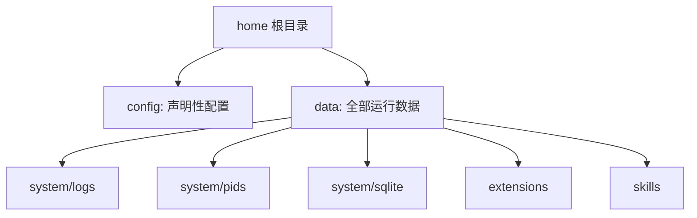

# 变更提案: home-layout-data-system

## 元信息
```yaml
类型: 重构
方案类型: implementation
优先级: P1
状态: 已完成
创建: 2026-05-11
```

---

## 1. 需求

### 背景
当前运行目录同时存在 `config/`、`data/` 与根级 `logs/`，而 `pid` 文件又直接挂在 `data/system/` 下。目录模型在语义上不够统一，尤其开发态 `.dev/logs/` 与 `data/` 分离后，很难保持“声明性配置 vs 运行数据”的清晰边界。

### 目标
把运行时目录收敛为：

- `config/`：声明性配置
- `data/`：全部运行数据
- `data/system/logs/`：系统与开发文本日志
- `data/system/pids/`：运行态与开发态 pid 文件

同时保证开发态 `.dev/` 与运行态 `~/.ennoia/` 使用同一套布局表达。

### 约束条件
```yaml
时间约束: 本轮只处理用户目录模型，不讨论 packaging
性能约束: 仅目录与路径重构，不改变日志与 pid 的读写机制
兼容性约束: 当前阶段不维护旧目录兼容，文档需与代码保持一致
业务约束: 尽量复用现有 RuntimePaths 接口，减少调用方改动
```

### 验收标准
- [ ] 运行时与开发态不再使用根级 `logs/`，日志统一进入 `data/system/logs/`
- [ ] `server.pid` 与 `dev.pid` 统一进入 `data/system/pids/`
- [ ] README 与运行目录文档、数据模型文档、架构文档全部同步为新的 `config` / `data` 模型

---

## 2. 方案

### 技术方案
在 `RuntimePaths` 中新增 `system_logs_dir()` 与 `system_pids_dir()`，并让现有 `logs_dir()`、`server_logs_dir()`、`server_pid_file()`、`dev_pid_file()` 等接口全部转向新的 `data/system/*` 层级。这样上层调用方基本不用重写调用模式，只需要吃到新的路径结果。同步修改 CLI launcher 的 stop 逻辑与文档中的目录示意。

### 影响范围
```yaml
涉及模块:
  - crates/paths: 统一运行时路径定义与目录初始化
  - crates/cli: stop/dev/start 相关 pid 与日志路径消费
  - crates/server: 前端日志与扩展日志目录消费
  - scripts: npm launcher 直接读取 pid 文件的逻辑
  - docs: 运行目录、数据模型、架构与 README 说明
预计变更文件: 8
```

### 风险评估
| 风险 | 等级 | 应对 |
|------|------|------|
| 仍有遗漏的硬编码旧路径 | 中 | 用全文搜索覆盖 `logs` / `pid` 相关引用并跑 `cargo test` |
| 文档与代码更新不同步 | 中 | 在同一轮里同步 README 与 docs，并以路径实现为最终真相 |
| 停止脚本读取不到新 pid 文件 | 高 | 同步修改 `scripts/cli-launcher.mjs` 并做静态检查 |

---

## 3. 技术设计

### 架构设计


### 数据模型
| 字段 | 类型 | 说明 |
|------|------|------|
| `data/system/logs/` | 目录 | 文本日志与开发日志输出目录 |
| `data/system/pids/` | 目录 | `server.pid`、`dev.pid` 等进程标记文件 |

---

## 4. 核心场景

### 场景: 运行时日志落盘
**模块**: `crates/paths` / `crates/server` / `crates/cli`
**条件**: 启动运行态或开发态
**行为**: 所有系统文本日志与前端日志统一写入 `data/system/logs/`
**结果**: 根级不再出现独立 `logs/` 目录

### 场景: 停止运行时
**模块**: `crates/cli` / `scripts/cli-launcher.mjs`
**条件**: 执行 `ennoia stop` 或 `npm run stop`
**行为**: 从 `data/system/pids/` 读取对应 pid 文件并结束进程
**结果**: 运行态与开发态都从统一的 pid 目录取值

---

## 5. 技术决策

### home-layout-data-system#D001: logs 与 pid 并入 data/system
**日期**: 2026-05-11
**状态**: ✅采纳
**背景**: 用户目录中 `config/` 与 `data/` 的边界已经基本成立，但根级 `logs/` 以及散落在 `data/system/` 下的 pid 文件破坏了“配置 vs 运行数据”的模型一致性。
**选项分析**:
| 选项 | 优点 | 缺点 |
|------|------|------|
| A: 保留根级 `logs/`，仅调整文档 | 改动最小 | 模型仍然割裂，`.dev/logs` 继续显得突兀 |
| B: `logs` 与 `pid` 全部收进 `data/system/*` | 目录语义统一，开发态和运行态一致 | 需要同步改路径实现、脚本与文档 |
**决策**: 选择方案 B
**理由**: `config/` 用来保存声明性配置，`data/` 用来保存全部运行数据；日志与 pid 本质上都属于运行数据，应该放在 `data/system/` 的子层级，而不是单独挂在根目录。
**影响**: 影响 `RuntimePaths`、CLI stop 路径、运行目录文档与数据模型描述。

---

## 6. 成果设计

N/A
